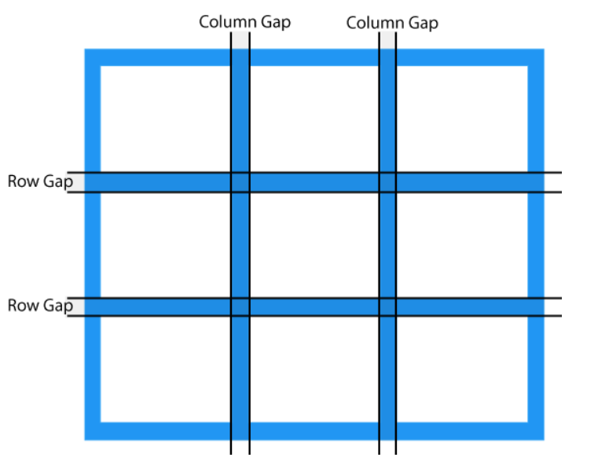

Grid - Helps to create 2D layout

In index.html and style.css we have created a 2D layout using flex.
which required quite some time and form more complex 2D layout, flex will consume more time to create.

In Grid -> We create a matrix with rows and columns

steps ->
1) First we create the spacing(grid) with marking rows and columns
2) then we can add elements in the grid one by one 

we assign height and width in fraction to avoid overflow of elements. 